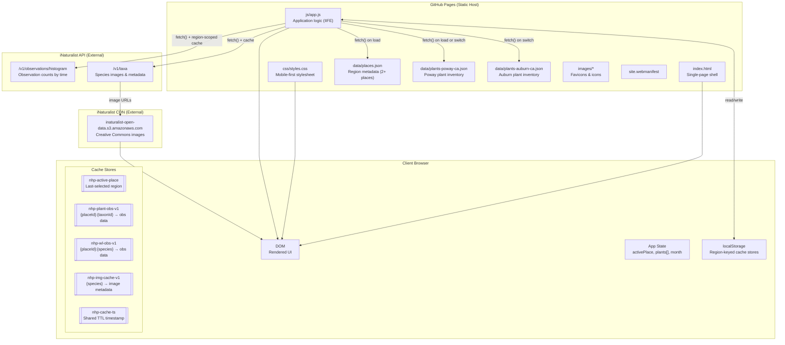
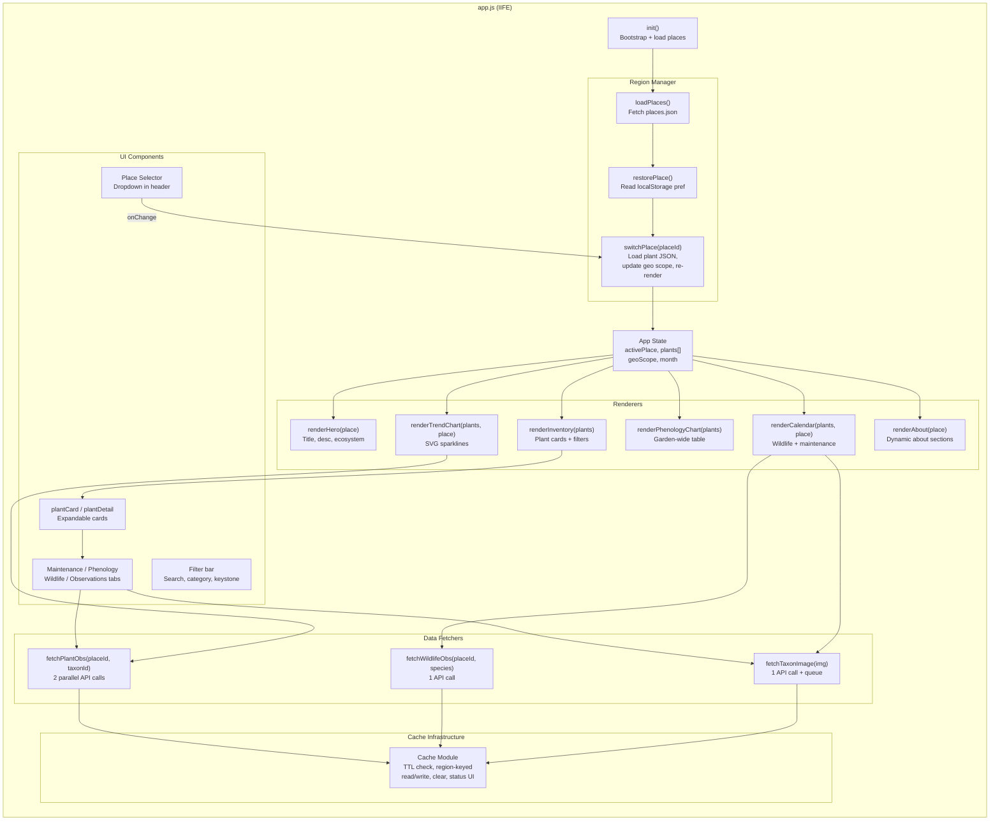
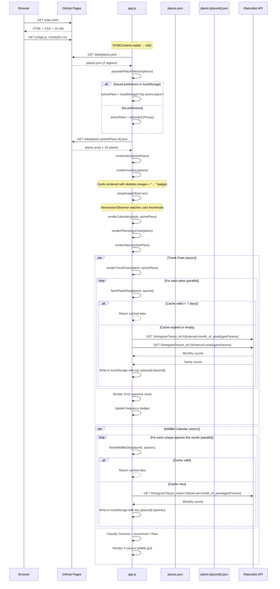
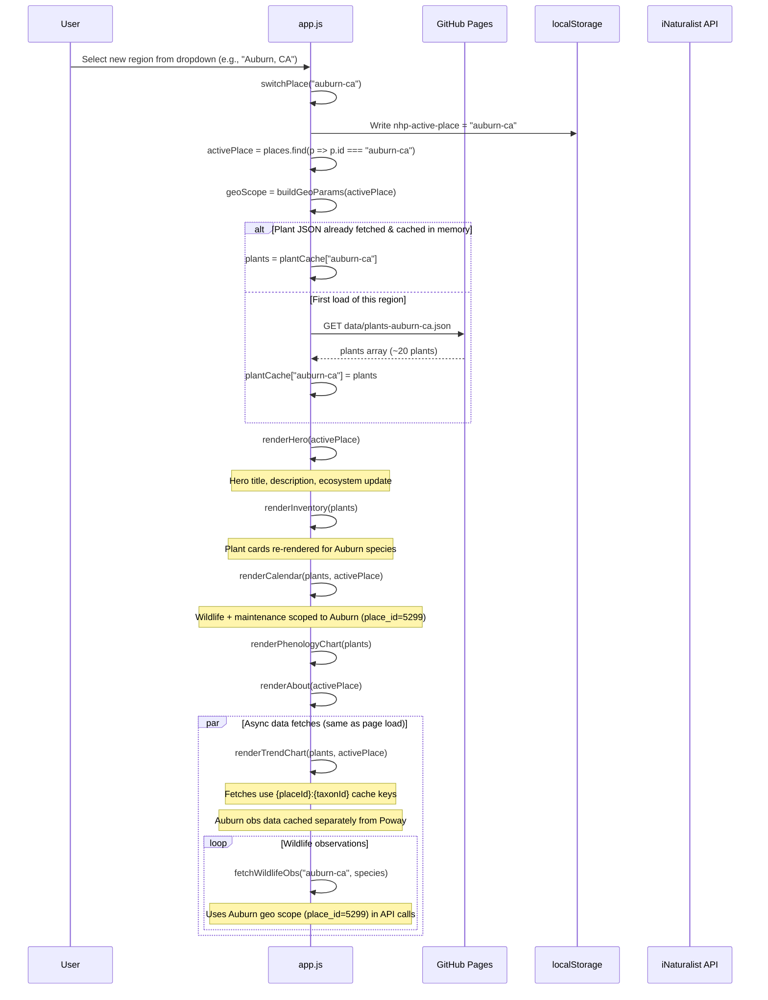
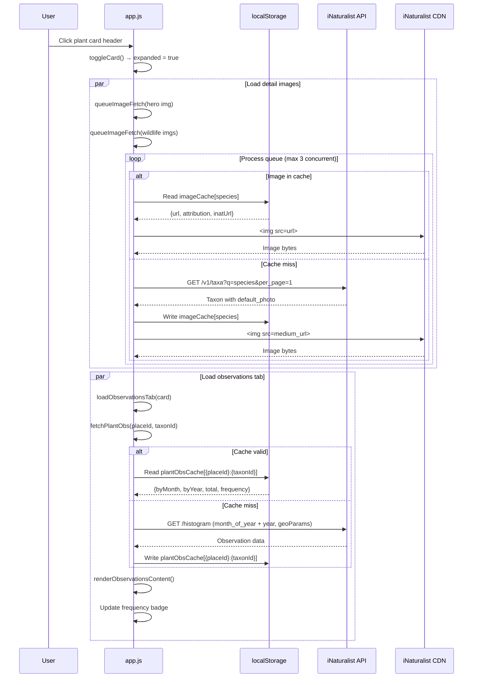
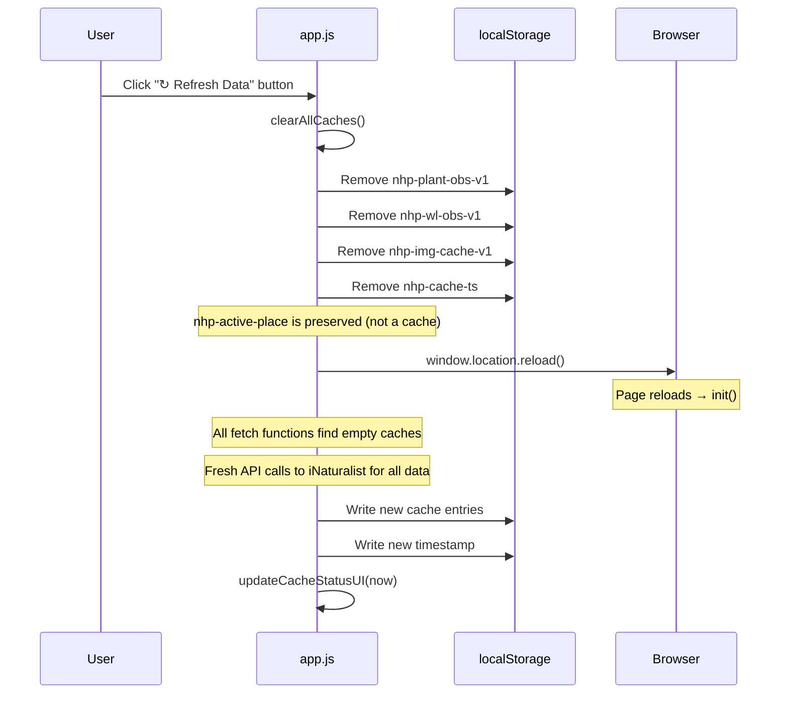
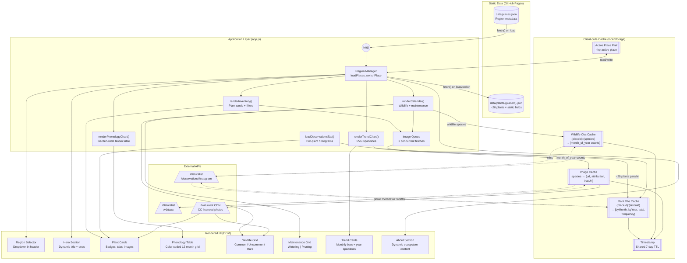
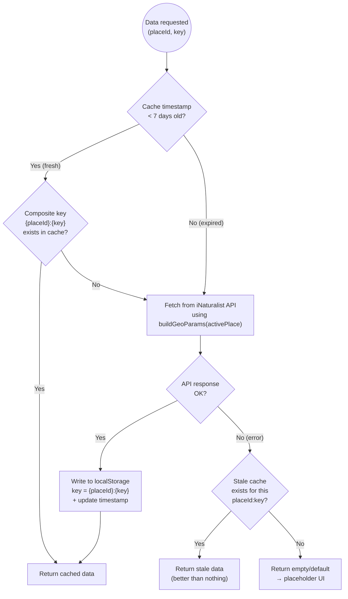

# Native Habitat Planner — Technical Design Document

**Project:** Native Habitat Garden Planner — Multi-Region California
**Version:** 1.0
**Last Updated:** 2026-04-14

---

## 1. Problem Statement

### Problem

Building a high-impact native habitat garden requires answering a deceptively complex set of questions: Which plants are native *here* (not just "California native" but hyperlocal to my zip code)? Which of those support the most wildlife — specifically the caterpillars that anchor Doug Tallamy's food web? What blooms when? What wildlife should I expect to see? How do I maintain everything month by month? Today this information is scattered across Calscape pages, iNaturalist records, NWF keystone databases, field guides, and the gardener's own memory — with no tool that synthesizes it for a specific location.

### Value

A single, data-driven reference site consolidates all of this into one place:

- **For the gardener:** A location-specific, curated plant list answers "what should I plant to maximize wildlife impact in *my* yard?" and a month-by-month dashboard answers "what should I do this week?" and "what wildlife should I look for?"
- **For conservation:** By anchoring plant selection around Tallamy's keystone-species framework, every garden built from this tool maximizes its contribution to the local food web — supporting the most caterpillars, which feed the most birds, which sustain the broadest biodiversity.
- **For scalability:** The multi-region architecture means the same site can serve any California community. Adding a new city requires only curating a plant list and either an iNaturalist place ID or a bounding box — no code changes.
- **For the community:** An open-source, no-cost, no-login site can inspire neighbors to plant native gardens and contribute to regional wildlife corridors.

---

## 2. Functional Requirements

Derived from the [Product Requirements Document](PRD.md) §3.

| ID | Requirement | Implementation |
|---|---|---|
| FR-0 | **Place of Interest selector** allowing users to switch between geographic regions (starting with Poway, CA and Auburn, CA) | Header dropdown reads `data/places.json` to populate options. Selection triggers async fetch of the region's plant data file (`data/plants-{place-id}.json`), updates the active geographic scope (iNaturalist `place_id` or bounding box) for all API calls, re-renders hero/about text from the place metadata, and persists the choice in `localStorage`. Each place specifies its scope via `iNaturalistPlaceId` (preferred — uses polygon boundaries) and/or `boundingBox` (fallback — rectangle coordinates). |
| FR-1 | **Plant inventory** per region with 15–22 species, each displaying common/scientific names, images, descriptions, keystone badge, wildlife species supported count, category, planting requirements, and links to Calscape/iNaturalist | Single-page app renders the active region's plant JSON into expandable card components grouped by category. Within categories, keystone species sort first, then by wildlife support count descending. Cards are filterable by category, keystone status, and free-text search. |
| FR-2 | **Maintenance schedule** per plant showing 12-month watering frequency and pruning tasks | Per-plant tab with two 6×2 grids (watering cells color-coded by frequency, pruning cells with scissor indicators). Current month highlighted. |
| FR-3 | **Bloom, berry & seed phenology** with actual botanical colors | Per-plant tab with 12-month color-coded cells (CSS gradients for multi-color blooms, stripe pattern for seeds, dot overlay for berries). Garden-wide phenology chart as a scrollable HTML table with sticky plant-name column. |
| FR-4 | **Wildlife schedule** per plant with specific named species, activity type, and month ranges | Per-plant tab listing each species with image, activity label, 12-month indicator grid, and notes. Images fetched at runtime from iNaturalist taxa API. |
| FR-5 | **Garden Calendar** showing garden-wide monthly summary scoped to the active region | Month-navigable dashboard with three sub-sections: wildlife (deduplicated by species, classified Common/Uncommon/Rare), maintenance (two-column: watering and pruning), and observation trends (SVG sparkline cards). All data reflects only the active region's plant list. |
| FR-6 | **Observation data** for each plant showing monthly histograms and year-over-year trends | Fetched at runtime from iNaturalist histogram API scoped to the active region's geographic scope (`place_id` or bounding box). Displayed in per-plant Observations tab and garden-wide trend chart. Frequency badge (common/uncommon/rare) derived from 5-year total. |
| FR-7 | **Wildlife rarity classification** using live observation counts | For each unique wildlife species in the current calendar month, the site fetches monthly observation data from iNaturalist scoped to the active geographic scope, then classifies species into Common/Uncommon/Rare using percentile-based thresholds calculated dynamically from the current month's data. |
| FR-8 | **Cache management** with manual refresh | Footer displays cache timestamp and a "Refresh Data" button that clears all `localStorage` caches and reloads the page. Caches are keyed by `{placeId}:{taxonIdOrSpecies}` to avoid cross-region collisions. |

---

## 3. Non-Functional Requirements

Derived from the [Product Requirements Document](PRD.md) §2.

| ID | Requirement | Implementation |
|---|---|---|
| NFR-1 | **Static hosting on GitHub Pages** — no server-side rendering | Entire site is HTML + CSS + JS + JSON. No build step, no server, no database. Deployed by pushing to `main` branch. |
| NFR-2 | **Performance: Lighthouse ≥ 90** across all categories | Page shell < 500 KB (excluding off-site images). Images lazy-loaded via `IntersectionObserver`. API calls parallelized and cached. CSS uses system font stack (no web font downloads). Region switch loads only one JSON file (~30 KB) per switch. |
| NFR-3 | **Accessibility: WCAG AA** | Semantic HTML (`<main>`, `<nav>`, `<section>`, `<article>`), ARIA landmarks and labels, keyboard-navigable cards (`tabindex`, `role="button"`, `aria-expanded`), skip link, sufficient color contrast, alt text on all images. Region selector uses `<select>` with proper `<label>`. |
| NFR-4 | **Responsive: 375px–1440px+** | Mobile-first CSS with breakpoints at 480px, 600px, and 768px. CSS Grid with `auto-fill`/`auto-fit` for fluid column counts. Hamburger menu on mobile. Region selector is always visible (not hidden behind hamburger). |
| NFR-5 | **SEO & social sharing** | `<title>`, `<meta description>`, Open Graph tags, Twitter Card tags, semantic heading hierarchy, favicon suite (SVG, PNG, ICO, Apple Touch Icon, Web App Manifest). Title and description dynamically reflect the active region. |
| NFR-6 | **Data freshness with 7-day TTL** | All runtime-fetched data (plant observations, wildlife observations, species images) cached in `localStorage` with a shared timestamp. Cache keys are prefixed with the place ID to keep region data separate. Expired entries are re-fetched on next access. |
| NFR-7 | **Graceful degradation** | If iNaturalist API is unavailable, the site falls back to stale cached data or shows placeholder states. Plant inventory, maintenance, phenology, and wildlife schedules all render from local JSON without any API dependency. |
| NFR-8 | **No external dependencies** | Zero npm packages, zero frameworks, zero CDN dependencies. Vanilla HTML/CSS/JS only. |

---

## 4. Assumptions & Considerations

| # | Constraint | Impact on Design |
|---|---|---|
| 1 | **GitHub Pages is static-only** — no server-side code, no environment variables, no scheduled jobs | All dynamic data (observation counts, species images) must be fetched client-side. There is no server to proxy API calls, enforce rate limits, or store secrets. The iNaturalist API is called directly from the browser. |
| 2 | **iNaturalist API has no authentication requirement** but informal rate limits (~1 req/sec recommended) | Plant observation fetches are parallelized in bulk (2 calls × ~20 plants = ~40 calls on first load of the trend chart). Wildlife observation fetches are parallelized per-month (up to ~15 unique species). Aggressive `localStorage` caching with a 7-day TTL minimizes repeat calls. Region switching re-uses existing caches if still valid. |
| 3 | **iNaturalist CDN images are hotlinked** — no local copies | If iNaturalist changes image URLs or goes down, images break. Mitigated by caching resolved image URLs in `localStorage`. All images are Creative Commons licensed and properly attributed. |
| 4 | **`localStorage` has a ~5 MB quota** per origin | Caches are keyed by `{placeId}:{key}`. With 2 regions × ~20 plants × ~40 wildlife species each, total cached data is estimated at ~1.5 MB. Adding more regions increases cache size linearly — at ~10 regions, we would approach the quota and may need to implement LRU eviction or migrate to IndexedDB. |
| 5 | **Separate JSON file per region** | Each region's plant data is a standalone JSON array (~30 KB for 20 plants). Only the active region's file is loaded; others are fetched on demand when the user switches. This keeps initial load fast regardless of how many regions exist. |
| 6 | **No build step** | All code is hand-written and committed as-is. No transpilation, minification, or bundling. This keeps the project simple but means no TypeScript, no JSX, and no tree-shaking. |
| 7 | **Geographic scope is stored in `places.json`, not hardcoded** | Unlike the reference project (single hardcoded bounding box), all geographic scoping lives in the data layer. Each place may specify an `iNaturalistPlaceId` (integer, preferred) and/or a `boundingBox` (4 coordinates, fallback). The JS reads the active place's scope from `places.json` and injects either `place_id=N` or `nelat=...&swlat=...` into every iNaturalist API call. Using `place_id` is preferred because iNaturalist places use curated polygon boundaries (not just rectangles), producing more precise observation data. Adding a new region requires zero code changes. |
| 8 | **Browser must support ES2020+** | The app uses optional chaining (`?.`), `Promise.all`, `async/await`, `IntersectionObserver`, `Map`, `Set`, and template literals. Supported by all target browsers (latest 2 versions of Chrome, Safari, Firefox, Edge). |
| 9 | **Plants may appear in multiple regions** | The same species (e.g., *Heteromeles arbutifolia*) may appear in both Poway and Auburn data files. Each region's JSON entry is independent — it has its own `iNaturalistData.searchUrl` scoped to that region's geographic scope. Cache entries are keyed by `{placeId}:{taxonId}`, so observation data is stored separately per region. |
| 10 | **iNaturalist `place_id` provides polygon precision** | When a place has an iNaturalist `place_id` (e.g., `5299` for Auburn State Recreation Area), API queries use that instead of a bounding box. This means observation data is scoped to the actual geographic polygon rather than a rough rectangle. The `boundingBox` is still stored as a fallback (for the "View on iNaturalist" search URL and for places without an iNaturalist ID). Both fields are optional — at least one must be present. |

---

## 5. Physical Component Diagram



### File Structure

```
native-habitat-planner/
├── index.html                          # Single-page app shell
├── css/
│   └── styles.css                      # Mobile-first responsive styles
├── js/
│   └── app.js                          # All application logic (single IIFE)
├── data/
│   ├── places.json                     # Region metadata array
│   ├── plants-poway-ca.json            # Poway plant inventory (~20 plants)
│   └── plants-auburn-ca.json           # Auburn plant inventory (~20 plants)
├── images/
│   ├── favicon.ico                     # 16×16 + 32×32 multi-res
│   ├── favicon.svg                     # SVG favicon
│   ├── apple-touch-icon.png            # 180×180
│   ├── icon-192.png                    # Android icon
│   └── icon-512.png                    # Android icon
├── site.webmanifest                    # PWA manifest
├── docs/
│   ├── PRD.md                          # Product requirements
│   └── tech-design.md                  # This document
├── .cursor/
│   └── skills/
│       ├── add-plant/SKILL.md          # Skill: add a plant to a region
│       └── add-city/SKILL.md           # Skill: onboard a new region
└── README.md
```

### Module Breakdown (`js/app.js`)

The entire application is a single IIFE with the following logical modules:



---

## 6. Sequence Diagrams

### 6.1 Page Load & Initialization



### 6.2 Region Switch



### 6.3 Plant Card Expansion & Image Loading



### 6.4 Cache Refresh Flow



---

## 7. Data Flow Diagram

### 7.1 Overall Data Flow



### 7.2 Cache Key Structure

All observation caches are **region-scoped** to prevent data from one bounding box leaking into another region's display. Image caches are shared across regions because the same species resolves to the same photo regardless of location.

```
localStorage keys:
├── nhp-active-place              → "auburn-ca"                    (string, no TTL)
├── nhp-cache-ts                  → 1713100000000                  (epoch ms, shared TTL)
├── nhp-plant-obs-v1              → {                              (JSON object)
│     "poway-ca:54999":  { byMonth: {...}, byYear: {...}, total: 1234, frequency: "common" },
│     "auburn-ca:54813": { byMonth: {...}, byYear: {...}, total: 567,  frequency: "uncommon" },
│     ...
│   }
├── nhp-wl-obs-v1                 → {                              (JSON object)
│     "poway-ca:Anna's Hummingbird":  { month_of_year: {1: 12, 2: 15, ...} },
│     "auburn-ca:Acorn Woodpecker":   { month_of_year: {1: 3, 2: 5, ...} },
│     ...
│   }
└── nhp-img-cache-v1              → {                              (JSON object, NOT region-keyed)
      "Anna's Hummingbird": { url: "https://...", attribution: "...", inatUrl: "..." },
      "Quercus lobata":     { url: "https://...", attribution: "...", inatUrl: "..." },
      ...
    }
```

### 7.3 Cache Decision Flow



---

## 8. Region Manager — Detailed Design

The Region Manager is the key architectural addition over the single-region reference project. It owns the lifecycle of place switching and ensures all downstream modules receive the correct bounding box and plant data.

### 8.1 State Model

```javascript
// App-level state (module-scoped within the IIFE)
const state = {
    places: [],              // Array from places.json
    activePlace: null,       // Current place object (id, name, iNaturalistPlaceId, boundingBox, etc.)
    plants: [],              // Current region's plant array
    plantsByRegion: {},      // In-memory cache: { "poway-ca": [...], "auburn-ca": [...] }
    currentMonth: new Date().getMonth() + 1,  // 1-indexed
};
```

### 8.2 Switch Flow (Pseudocode)

```javascript
async function switchPlace(placeId) {
    const place = state.places.find(p => p.id === placeId);
    if (!place) return;

    state.activePlace = place;
    localStorage.setItem('nhp-active-place', placeId);

    // Load plant data (from memory cache or fetch)
    if (state.plantsByRegion[placeId]) {
        state.plants = state.plantsByRegion[placeId];
    } else {
        const resp = await fetch(`data/${place.plantDataFile}`);
        state.plants = await resp.json();
        state.plantsByRegion[placeId] = state.plants;
    }

    // Re-render everything with new data + geographic scope
    renderHero(place);
    renderInventory(state.plants);
    renderCalendar(state.plants, place);
    renderPhenologyChart(state.plants);
    renderTrendChart(state.plants, place);
    renderAbout(place);
    updateCacheStatusUI();
}
```

### 8.3 Geographic Scope Injection

Every iNaturalist API call receives geographic scoping from the active place. If the place has an `iNaturalistPlaceId`, the API uses `place_id=N` (polygon-based, more precise). Otherwise it falls back to bounding box coordinates.

```javascript
function buildGeoParams(place) {
    if (place.iNaturalistPlaceId) {
        return `place_id=${place.iNaturalistPlaceId}`;
    }
    const bb = place.boundingBox;
    return `nelat=${bb.nelat}&nelng=${bb.nelng}&swlat=${bb.swlat}&swlng=${bb.swlng}`;
}

function buildHistogramUrl(taxonId, interval) {
    const geoParams = buildGeoParams(state.activePlace);
    const d1 = new Date().getFullYear() - 5;
    return `https://api.inaturalist.org/v1/observations/histogram`
        + `?taxon_id=${taxonId}`
        + `&${geoParams}`
        + `&interval=${interval}`
        + `&d1=${d1}-01-01`;
}
```

No geographic scope is ever hardcoded in JavaScript. All scoping flows from `places.json` → `state.activePlace` → `buildGeoParams()` → API call URL. The `place_id` approach is preferred because iNaturalist places use curated polygon boundaries — for example, `place_id=5299` (Auburn State Recreation Area) scopes queries to the actual park boundary rather than a rough rectangle.

---

## 9. Sorting & Filtering — Detailed Design

Within each category group, plants are sorted by a composite key that reflects the Tallamy selection philosophy:

```javascript
function sortPlants(plants) {
    const categoryOrder = [
        'large-tree', 'large-shrub', 'small-shrub',
        'herbaceous-perennial', 'groundcover-perennial', 'groundcover-annual'
    ];

    return [...plants].sort((a, b) => {
        // Primary: category order
        const catDiff = categoryOrder.indexOf(a.category) - categoryOrder.indexOf(b.category);
        if (catDiff !== 0) return catDiff;

        // Secondary: keystone species first
        if (a.isKeystone !== b.isKeystone) return a.isKeystone ? -1 : 1;

        // Tertiary: wildlife species supported (descending)
        const wDiff = (b.wildlifeSpeciesSupported || 0) - (a.wildlifeSpeciesSupported || 0);
        if (wDiff !== 0) return wDiff;

        // Quaternary: alphabetical by common name
        return (a.commonNames[0] || '').localeCompare(b.commonNames[0] || '');
    });
}
```

---

## 10. API Call Budget & Rate Limiting

### 10.1 Estimated API Calls per Region Load

| Trigger | Calls | When |
|---|---|---|
| Plant observations (trend chart) | 2 × N plants (month + year intervals) | First visit or cache expired |
| Wildlife observations (calendar) | 1 × M unique species for the current month | First visit or cache expired, re-triggered on month change |
| Taxon image lookups | 1 × (N plants + K wildlife species) | First card expansion or lazy-load trigger |
| **Worst case (20 plants, 40 wildlife)** | **~40 + ~15 + ~60 = ~115 calls** | **Cold start with empty cache** |
| **Typical visit (warm cache)** | **0 calls** | **Within 7-day TTL** |

### 10.2 Rate Limiting Strategy

iNaturalist recommends ~1 request/second. With ~115 cold-start calls, naive parallelization could spike. Mitigations:

1. **Trend chart calls** are fired in parallel with `Promise.all` but the 7-day cache ensures this only happens once per week
2. **Image fetches** use a concurrency-limited queue (max 3 simultaneous requests)
3. **Wildlife observation calls** are parallelized per month but limited to the species active in the selected month (~8–15 species)
4. **Region switching** re-uses existing caches — if the user previously visited Auburn, switching back is instant

---

## 11. Accessibility Implementation

| Area | Approach |
|---|---|
| **Region selector** | `<select>` element with `<label>` and `aria-label="Select a region"`. Focus returns to selector after region switch completes. |
| **Plant cards** | `role="button"`, `tabindex="0"`, `aria-expanded="true/false"`. Enter and Space keys toggle expansion. |
| **Keystone badge** | Visible text + `aria-label="Keystone species"` for screen readers. Not conveyed by color alone. |
| **Wildlife count badge** | Text like "Supports 334 wildlife species" is both visible and screen-reader accessible. |
| **Filter controls** | Checkbox filters use `<fieldset>` + `<legend>`. Search input has `aria-label`. Active filter count announced via `aria-live="polite"` region. |
| **Calendar month navigation** | Previous/next buttons have `aria-label="Previous month"` / `"Next month"`. Current month announced. |
| **Images** | All `` tags have `alt` text derived from species name + photographer credit. Skeleton placeholders have `aria-hidden="true"`. |
| **Skip link** | First focusable element: "Skip to main content" linking to `<main>`. |

---

## 12. Testing Strategy

| Layer | Approach |
|---|---|
| **Data validation** | JSON schema check (Node script or manual): every plant has required fields, taxon IDs are positive integers, bounding boxes have 4 valid coordinates, wildlife species names follow naming rules |
| **iNaturalist integration** | Automated curl-based checks (per add-plant skill Step 7): verify every wildlife species name resolves for both image and observation queries |
| **Visual / UI** | Manual browser testing across Chrome, Safari, Firefox at 375px, 768px, 1440px. Region switching tested for all combinations (A→B, B→A, refresh on each). |
| **Accessibility** | Lighthouse accessibility audit ≥ 95. Manual keyboard navigation test. Screen reader spot-check (VoiceOver on macOS). |
| **Performance** | Lighthouse performance ≥ 90. Verify page shell < 500 KB via DevTools Network tab (disable cache, exclude off-site images). |
| **Cache correctness** | Verify region-scoped cache keys don't leak: load Poway, load Auburn, verify observation data for each is distinct. Clear cache and verify fresh fetches occur. |
